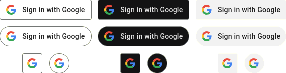

# react-google-signin-button



"Sign in with Google" button for React. Follows [the official guidelines](https://developers.google.com/identity/branding-guidelines). Note that this module does not provide authentication itself; it only offers a button.

## Installation

```shell
$ npm install react-google-signin-button
```

## Usage

Import `GoogleButton` component and required CSS file.

```js
import GoogleButton from 'react-google-signin-button';
import 'react-google-signin-button/dist/button.css';

function App() {
  return (
    <div>
      <GoogleButton
        onClick={() => { console.log('Google button clicked'); }}
      />
    </div>
  );
}
```

**Why are the styles in external CSS file and not as inline styles?**

Using an external CSS file allows you to make small adjustments by
adding your own CSS. Pseudo-classes `:active` and `:focus` cannot
be used with inline styles without adding NPM dependencies.

## Props

| Name | Type | Default Value | Description |
| ---- | ---- | ------------- | ----------- |
| `label` | string | `Sign in with Google` | Text in the button. See [Google documentation](https://developers.google.com/identity/branding-guidelines). |
| `theme` | string | `light` | `light`, `dark` or `neutral` |
| `shape` | string | `rectangular` | `rectangular`, `pill`, `square` or `circle`. Use `square` or `circle` when you want the logo only. |
| `size` | string | `md` | `lg`, `md`, or `sm` |
| `logoAlign` | string | `left` | When using custom width, the logo can be aligned with this. `left` or `center` |

Other props are passed to the `button` element, such as:
* `onClick`
* `disabled`
* `className`
* `style`

## Development

```shell
$ npm run rollup
```

This builds files under `dist/` directory.
